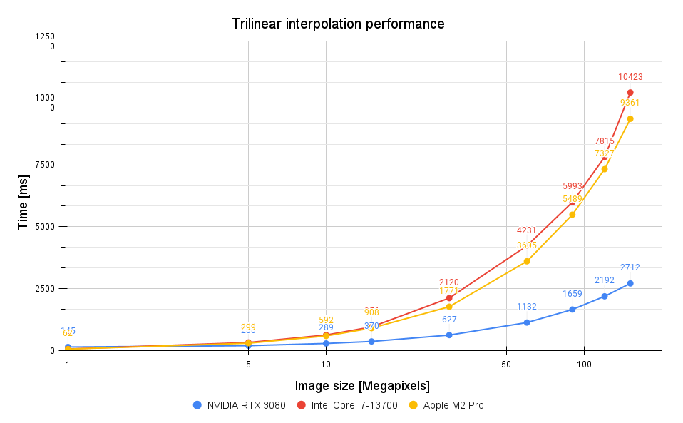
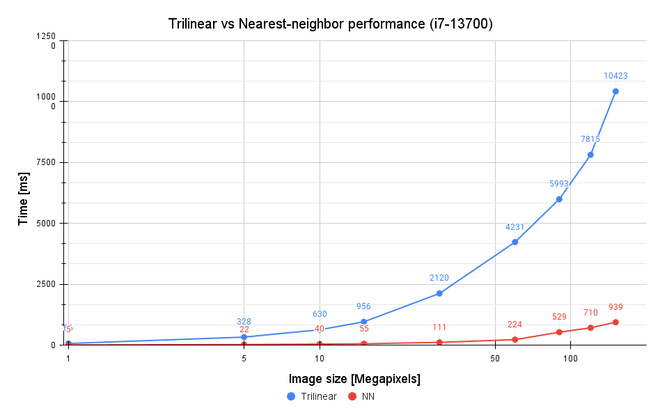
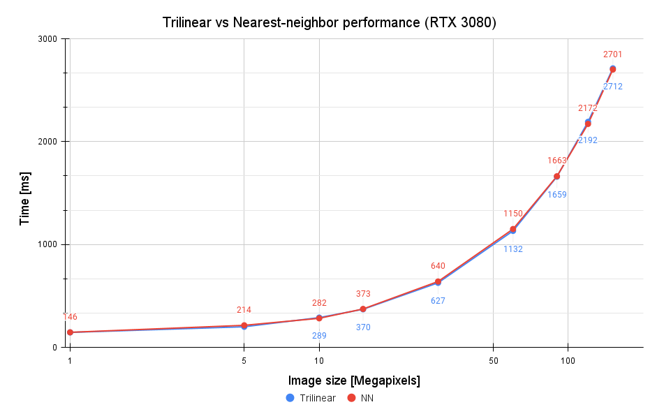

# Performance tests
## Test setups
| Component | Name                                                     |
| --------- | -------------------------------------------------------- |
| CPU       | Intel Core i7-13700@2.1Ghz (Turbo Boost: 5.2Ghz, 16C/24T)|
| GPU       | NVIDIA GeForce RTX 3080 10GB                             |
| RAM       | 32GB DDR4 (3600 Mhz)                                     |

| Component | Name                       |
| --------- | ---------------------------|
| Name      | Apple MacBook Pro 16" 2023 |
| CPU       | Apple M2 Pro               |
| RAM       | 32GB                       |

The tests have been performed on a set of 9 pictures with a resolution from 1 to 151 MPix and a 3D LUT of size 33.

  

The trilinear interpolation method provides excellent image quality at the cost of higher mathematical complexity.
This is a perfect scenario for a GPU, as it fully utilizes its potential to accelerate heavy floating point compute operations combined with the parallel nature of the image matrix.
The memory copying/allocation costs are fully compensated by the performance gains for images of size higher than 1 MPix. 

  
The nearest-value interpolation provides worse image quality, but it's much faster than the previous method. Its computational complexity is not high enough to compensate for the GPU memory I/O latency, so the performance of CUDA kernels is worse than multithreaded implementation.

  
Nearest-neighbor interpolation is significantly faster on the CPU than the trilinear method.

  
The results are nearly identical, meaning that almost entire time cost is consumed by the memory I/O operations (copying image matrix between the local RAM and GPU VRAM).
