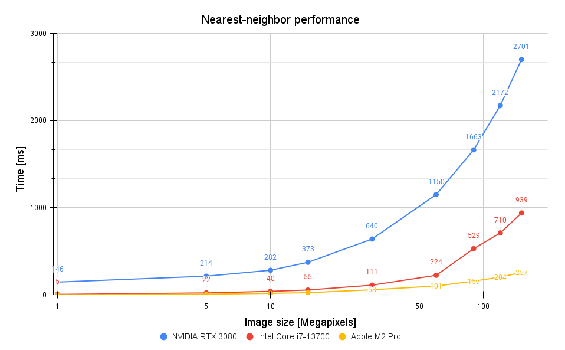

# Cube LUT Loader
<center></center>

A simple command-line C++ tool that lets you apply a Cube format LUT to your image.
It contains multithreaded and GPU-accelerated (CUDA) modes, which result in very high performance.

## Program options
```
  -h [ --help ]                  Help screen
  -i [ --input ] arg             Input file path
  -l [ --lut ] arg               LUT file path
  -o [ --output ] arg (=out.png) Output file path [= out.png]
  -s [ --strength ] arg (=1)     Strength of the effect [= 1.0]
  -t [ --trilinear ]             Trilinear interpolation of 3D LUT
  -n [ --nearest_value ]         No interpolation of 3D LUT
  -j [ --threads ] arg (=8)      Number of threads [= Number of physical threads]
  --gpu                          Use GPU acceleration
```

## Hardware requirements
A suitable NVIDIA GPU is required for the GPU mode to work (preferably with compute capability 6.1 or up).
However, if you don't have one, you can still use the program in CPU mode!

## Used libraries
- OpenCV 4.5.5
- Boost 1.78.0
- Eigen 3.4.0 (Vectors and Tensor module)
- CUDA 11.6

## Features
- 1D LUT support
- 3D LUT support
    - Nearest value mode (faster, low quality of tonal transitions)
    - Trilinear interpolation (slower, high quality)
- Simple input arguments-based interface
- Multithreaded implementation (the number of physical CPU threads is used by default)
- CUDA GPU implementation (highly effective with larger images)

## Performance
### Test details
Test setups:  
| Component | Name                                                     |
| --------- | -------------------------------------------------------- |
| CPU       | Intel Core i7-13700@2.1Ghz (Turbo Boost: 5.2Ghz, 16C/24T)|
| GPU       | NVIDIA GeForce RTX 3080 10GB                             |
| RAM       | 32GB DDR4 (3600 Mhz)                                     |

| Component | Name                       |
| --------- | ---------------------------|
| Name      | Apple MacBook Pro 16" 2023 |
| CPU       | Apple M2 Pro               |
| RAM       | 32GB                       |

Tests were performed on a set of 9 pictures with a resolution from 1 to 151 MPix and a 3D LUT of size 33.

  

The trilinear interpolation method provides excellent image quality at the cost of higher mathematical complexity.
This is a perfect scenario for a GPU, as it fully utilizes its potential to accelerate heavy floating point compute operations combined with the parallel nature of the image matrix.
The memory copying/allocation costs are fully compensated by the performance gains for images of size higher than 1 MPix. 

  
The nearest-value interpolation provides worse image quality, but it's much faster than the previous method. Its computational complexity is not high enough to compensate for the GPU memory I/O latency, so the performance of CUDA kernels is worse than multithreaded implementation.

  
Nearest-neighbor interpolation is significantly faster on the CPU than the trilinear method.

  
The results are nearly identical, meaning that almost entire time cost is consumed by the memory I/O operations (copying image matrix between the local RAM and GPU VRAM).

## In progress
- GPU acceleration for 1D LUTs
- Support of color depths other than 8-bit
- Batch processing
